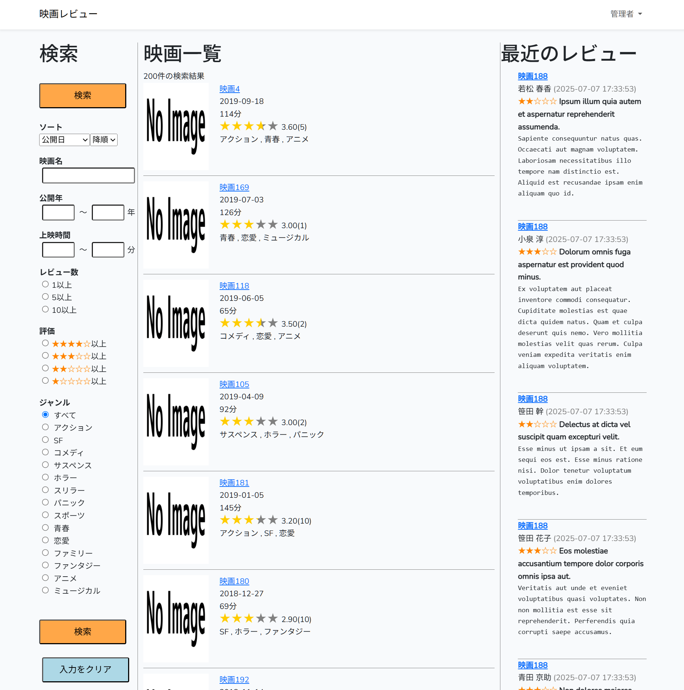

# 映画レビューアプリケーション

このアプリケーションは、Laravelを使用して構築された映画情報の管理とレビュー投稿ができるWebアプリケーションです。

## サイトの外観

映画やレビューはダミーデータです。

## 主な機能

- **映画情報**
    - 映画の一覧表示、検索、ソート機能（公開日、評価、レビュー数など）
    - 映画情報の詳細表示
    - 映画情報の追加・編集・削除（管理者権限）
- **レビュー機能**
    - 映画に対するレビュー（5段階評価、タイトル、本文）の投稿・編集・削除
    - 最新レビューの一覧表示
- **ユーザー機能**
    - ユーザー登録、ログイン、ログアウト
    - 権限管理（管理者、一般ユーザー）
- **ジャンル管理**
    - 映画への複数ジャンル設定
    - ジャンルの追加（管理者権限）
- **画像アップロード**
    - 映画ポスター画像の登録・更新
